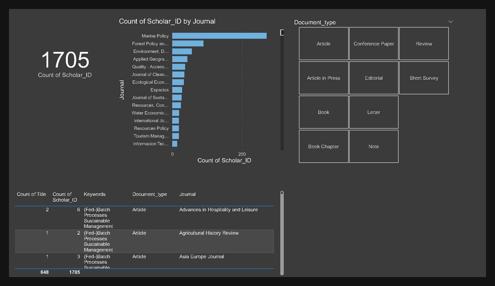
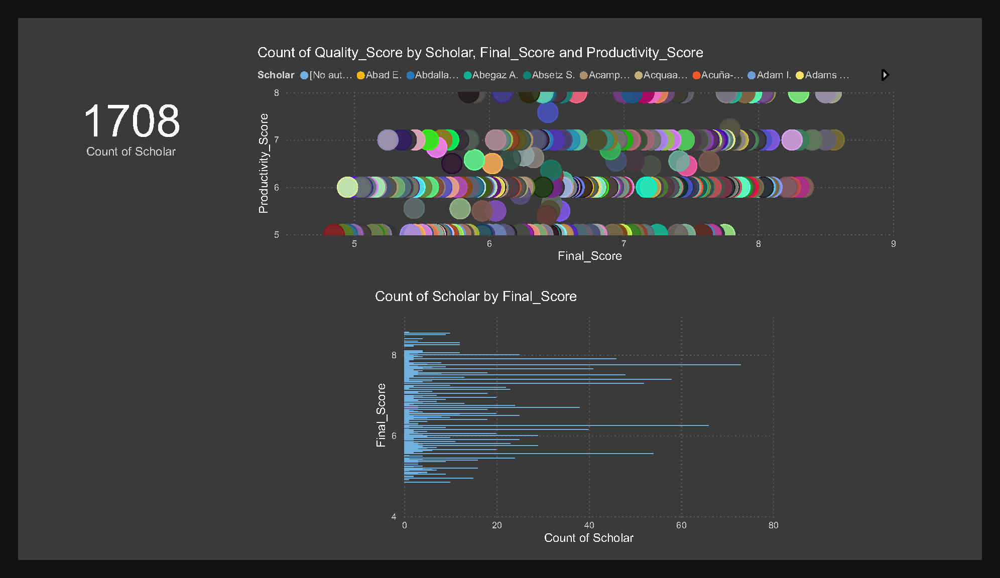
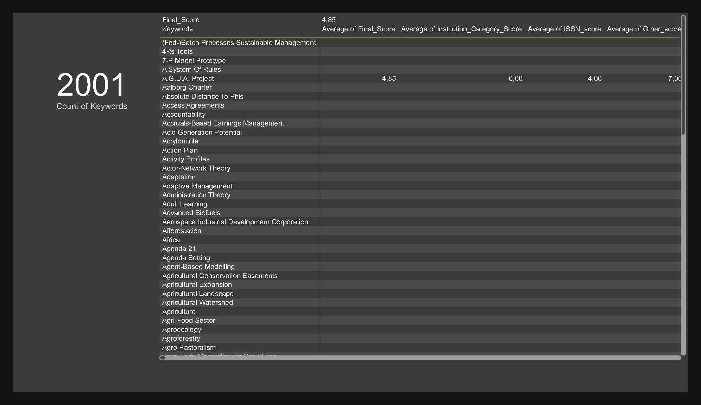

# 📚 Crisis & Sustainability: Data-Driven Analysis of the 2008 Financial Crisis

This project uses natural language processing to analyze journal articles related to the 2008 global financial crisis. It identifies key topics, sentiments, and academic narratives that emerged during and after the crisis using topic modeling.

[⬅️ Back to Portfolio Home](../README.md)

---

## 📌 Project Overview

- **Objective**: Understand dominant narratives and themes in academic journals during the 2008 crisis.
- **Dataset**: Full-text journal articles (in PDF and processed text).
- **Tools**: Python, NLTK, Gensim, Scikit-learn, PyLDAvis.
- **Techniques**: Text Cleaning, LDA Topic Modeling, Wordclouds, Visualization.

---

## 📁 Folder Structure

segmentasi-resep-indonesia/
├── README.md
├── data/
│ ├── raw/
│ └── processed/
├── notebooks/
│ ├── eda.ipynb
│ └── clustering.ipynb
├── app/
│ └── streamlit_app.py
├── images/
│ ├── cluster_plot.png
│ └── wordcloud.png
├── requirements.txt
└── LICENSE


---

## 🔍 Key Insights

- Identified 5–7 major topics across 100+ journal articles.
- Showed trends of environmental, policy, and social justice discourses evolving over time.
- Mapped topic prevalence from 2008 to 2013.

📷 *Example Visualizations*:

  
  


---

## ▶️ Outputs

- LDA topic clusters
- Topic trends over time
- Diversification of academic discourse types
- Interactive Power BI Dashboard (local)

---

## 🔧 How to Run (Reproducibility)

```bash
pip install -r requirements.txt
# Then run Jupyter notebooks in notebooks/